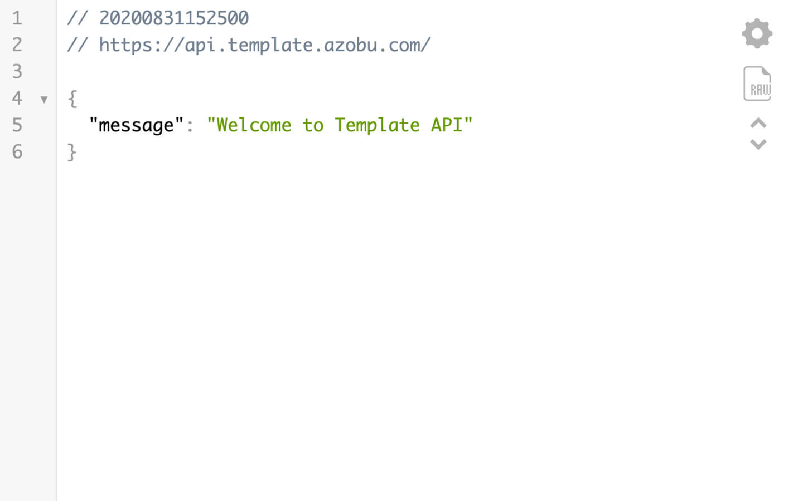

# ⭕ [Template](https://template.azobu.com)

> [Template](https://github.com/azobu-projects/template) is a quick starter kit project to build a complete web app and API with highly opiniated technologies and structure around JavaScript ecosystem.

| Web                                                                 | API                                                                    |
| ------------------------------------------------------------------- | ---------------------------------------------------------------------- |
|  | >) |

## Table of Contents

- Introduction
- [Links](#links)
- [Inspirations](#inspirations)
- [Features](#features)
- [Designs](#designs)
- [Authors](#authors)
- [License](#license)

## Links

Access to the production version of the applications with their corresponding repositories:

- [Template Web](https://template.azobu.com)
  - [`template-web`](https://github.com/azobu-projects/template-web)
- [Template API](https://api.template.azobu.com)
  - [`template-api`](https://github.com/azobu-projects/template-api)
- (Later) Template Android
- (Later) Template iOS

Other things such as documentation and design:

- [Template Spec](SPECIFICATIONS.md)
- [Template Design](https://figma.com/file/gyEXMrNXwVEBfdrSkJlJYV/Template?node-id=450%3A2)
- [Template Prototype](https://figma.com/proto/gyEXMrNXwVEBfdrSkJlJYV/Template?node-id=452%3A2&scaling=min-zoom)

Ultimately this base application can be adapted into other sites and apps:

- ⭐ [Azobu](https://azobu.com) learning platform
- 🗼 [Acme](https://acme.azobu.com) company profile
- 📝 [Yesdo](https://yesdo.azobu.com) task tracking and note taking
- 📞 [Connecto](https://connecto.azobu.com) contact and address book manager
- 🌌 [The Galactic News](https://thegalacticnews.azobu.com) news portal
- 🌏 [Earthling](https://earthling.azobu.com) social media
- 🪐 [Planetary](https://planetary.azobu.com) job board
- 👋 [Jankenpon](https://jankenpon.azobu.com) rock-paper-scissors game
- [and much more](https://azobu.com/projects)

## Inspirations

Template project is inspired by:

- [Material Design Kit](https://materialdesignkit.com)
- [RealWorld.io](https://github.com/gothinkster/realworld)
  - [`react-redux-realworld`](https://github.com/gothinkster/react-redux-realworld-example-app)
  - [`node-express-realworld`](https://github.com/gothinkster/node-express-realworld-example-app)
- [React.js Boilerplate](https://reactboilerplate.com)
- [Express application generator](https://expressjs.com/en/starter/generator.html)

Instead of taking different programming ecosystem at once, Template is made to be highly opiniated for just around JavaScript and Node.js because the main goal is to be a quick starter kit for new professional developers.

> 🚧 TypeScript and Deno might be later

## Features

- Highly opiniated structure to start a project faster
  - Focused on JavaScript, Node.js, React, and Express ecosystem
  - Later possible with TypeScript too
- Simple user interface (UI) and quick user experience (UX)
  - Powered by Figma, React, React Router, and Redux
  - Albeit the opiniated specification, Template want to focus on good end-user experience
  - Adapting inspirations from apps like Twitter and Instagram
- Encouraged with popular best practices and recommendations
  - Intuitive React Redux structure
  - Intuitive Express middleware structure
  - Clean Code
  - The Twelve-Factor App
  - Continuous Integration and Deployment (CI/CD)
  - Only use necessary abstraction
- Communication with popular and standard HTTP-based API
  - Powered by REST API. Maybe later by GraphQL API too
- Frontend and backend documentations
  - Leveraged by simple table for web pages and API endpoints
- Interactive documentation of the API endpoints
  - (Later) Powered by Postman, Swagger, and API Blueprint
- Optimized developer experience (DX) through npm/yarn scripts
  - Leveraged by `package.json` and PM2 with `ecosystem.config.js`
  - Automated deployment by Netlify and Circle CI
- Watch changes with hot reload for React and auto restart for Node.js
  - Powered by React Scripts (Webpack and Babel), Nodemon, and PM2
- Flexible customizable interface with color theme, especially dark mode
  - Powered by `styled-system`, `xstyled`, and `emotion`
  - Not using premade design such as Bootstrap or Material Design
- Better debugging experience for global app state and local form state
  - Powered by Redux Logger, Redux DevTools Extension, and React Hook Form
  - (Alternative) Added by Formik or React Final Form
- Get and display data resources such as users and items
  - Powered by Axios, Redux Thunk, and `async`/`await` for asynchronous handling
  - Using standardized names of action types
- Adaptive page title based on location path and data condition
  - Powered by React Helmet Async and nice favicons
- Search and filter items with adapted browser URL query
  - Powered by combination of Redux, React Router, and `query-string`
- Authentic and cool-looking initial seed users and items
  - Sourced from Marvel universe's characters and items
  - Not using fake data generator
- Easy to use database technologies
  - Powered by MongoDB with Mongoose or PostgreSQL with Sequelize
- Simple user authentication and authorization flow with basic security
  - Powered by Web Storage API, HTTP Cookie, `bcrypt`, JSON Web Token (JWT), CORS, and Helmet
  - Not using Passport for basic email and password
- Log HTTP API requests
  - Powered by `morgan` Express middleware
- Proper response of message and error
  - Using Express middlewares with advised HTTP response status
- Edit user profile and upload files/images
  - Powered by `multer` Express middleware using `FormData`
  - (Alternative) Separated storage engine for static assets:
    - Google Storage Engine
    - Cloudinary
- Multi environment configurations and variables for development, test, and production
  - Powered by React Scripts and `dotenv-flow` to manage `.env` files
- Helpful analytical data tracking
  - Powered by Google Analytics and React-GA
- Vibrant utilities for various case of other features:
  - `dayjs` date parser
  - Image or component lazy loader
  - HTML string parser
  - WYSIWYG editor
  - (Later) Markdown editor
  - (Later) Code syntax highlighter
- Send email for registration confirmation and password reset link
  - (Later) Powered by Nodemailer and Mailgun
- Application monitoring with error and log tracking
  - (Later) Powered by Sentry and LogRocket
- Consistent code quality using static test linter and code formatter
  - Powered by ESLint, Prettier, and Standard
  - Encouraging to use `prop-types` in React
- Automated test suite with end-to-end test, integration test, unit test, and test coverage
  - (Later) Powered by Cypress, Jest, Sinon, React Testing Library, and `supertest`/`supertest-fetch`
- Reliable secure server hosting and configuration, with HTTPS
  - Powered by Netlify, Google Cloud Platform, Nginx, Let's Encrypt, Cloudflare, and Uniregistry
- Intuitive CI/CD tools to manage deployment process
  - Powered by Netlify CI and Circle CI
- (Later) Pagination and indexing on client and server side
- (Later) Remote data caching
  - Powered by React Query or SWR
- (Later) Dedicated administrator dashboard for data management and visualization
  - Powered by D3.js
- (Later) Periodic dependency cleaning and vulnerability monitoring by Greenkeeper and Snyk
- (Later) Support for Geolocation API
- (Later) Support for Payment Gateway
  - Powered by Stripe, Braintree, PayPal, or Midtrans
- (Later) Real-time full text search
  - Powered by Algolia or Elasticsearch
- (Later) Offline-first mode powered by Progressive Web App (PWA) approach
- (Later) Consultation with the developers
- (Later) Explanation with videos

Some stack alternatives are listed in each repository's documentation.

## Designs

| Name           | Screenshots                                  |
| -------------- | -------------------------------------------- |
| Home           |            |
| Home Dark      |       |
| About          |           |
| Not Found      |       |
| Users          |           |
| User Profile   |    |
| Items          |           |
| Item           |            |
| Search Results |  |
| Login          |           |
| User Settings  |   |
| Logout         |          |

## Authors

- [M Haidar Hanif](https://mhaidarhanif.com) ([@mhaidarh](https://github.com/mhaidarh))
- [Azobu Team](https://azobu.com) ([@azobu](https://github.com/azobu))

## License

See [LICENSE](./LICENSE)
