# ⭕ Template

> Template is a quick starter kit project to build a complete web app and API.

You can access the production version of the app here:

- [Template Web](https://template.azobu.com)
- [Template API](https://api.template.azobu.com)

## Repositories

- [`template`](https://github.com/azobu-projects/template)
- [`template-web`](https://github.com/azobu-projects/template-web)
- [`template-api`](https://github.com/azobu-projects/template-api)

[See the spefications here](./SPECIFICATIONS.md).

## Inspirations

This project is inspired by:

- [Material Design Kit](https://materialdesignkit.com)
- [React.js Boilerplate](https://reactboilerplate.com)
- [Express application generator](https://expressjs.com/en/starter/generator.html)

## Designs

Access the original assets on Figma:

- Design: https://figma.com/file/gyEXMrNXwVEBfdrSkJlJYV/Template?node-id=450%3A2
- Prototype: https://figma.com/proto/gyEXMrNXwVEBfdrSkJlJYV/Template?node-id=452%3A2&scaling=min-zoom

### Preview of the Pages

| Name           | Screenshots                                  |
| -------------- | -------------------------------------------- |
| Home           | 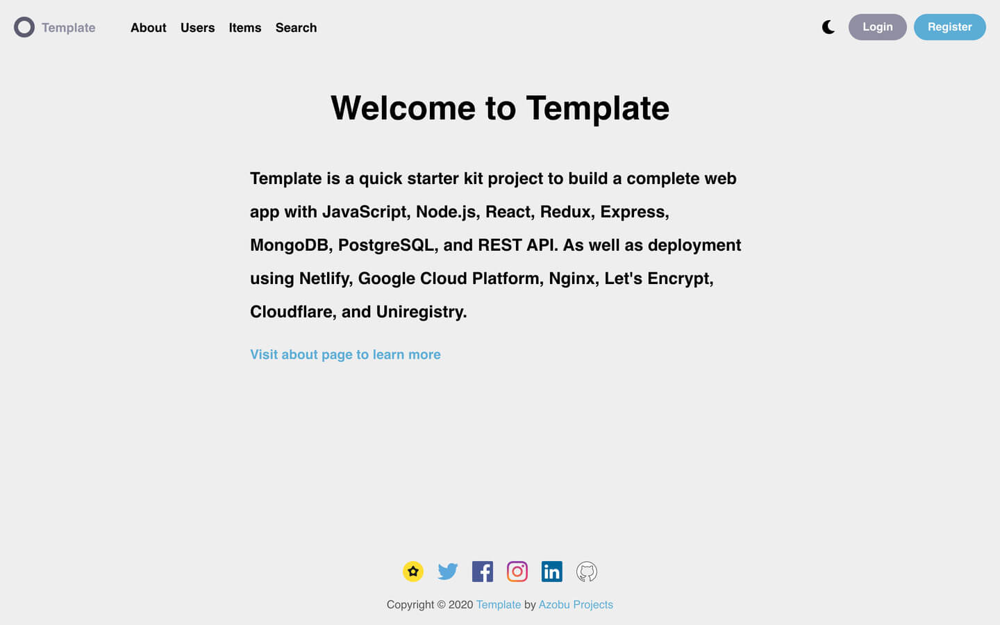           |
| Home Dark      | 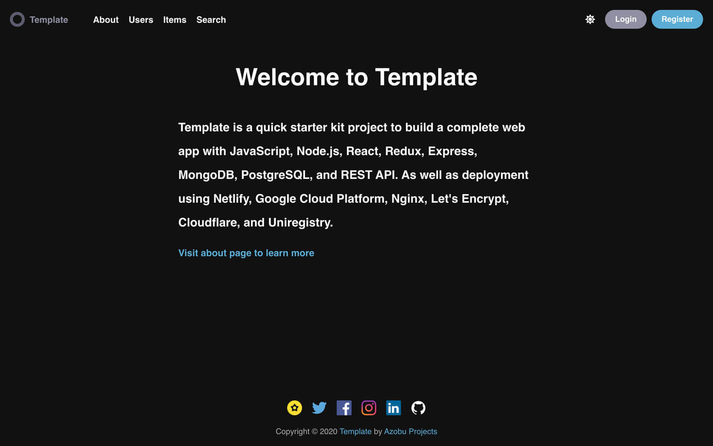      |
| About          | 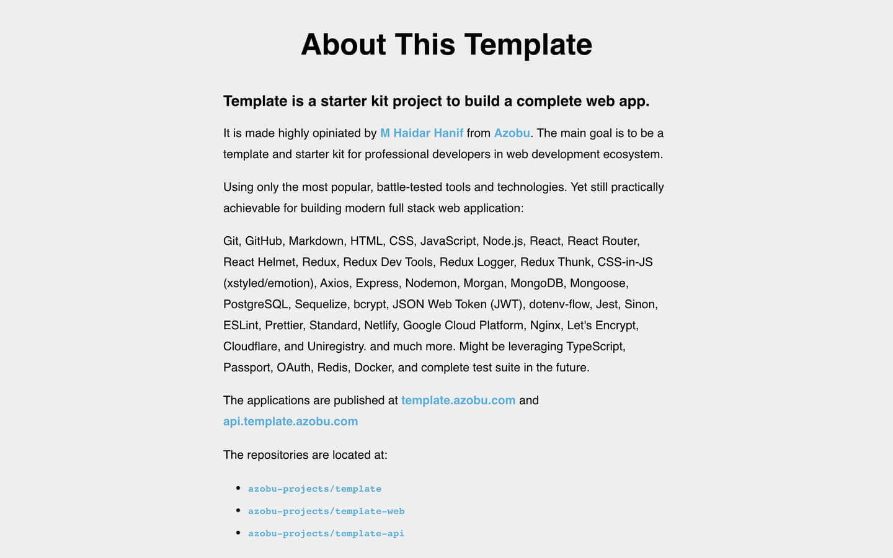          |
| Not Found      |       |
| Users          | 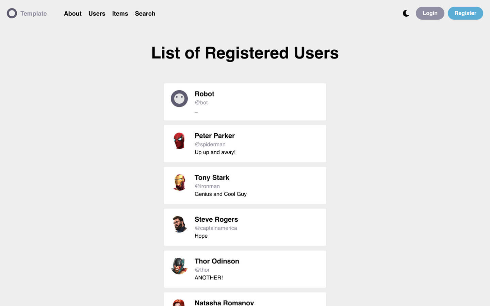          |
| User Profile   | 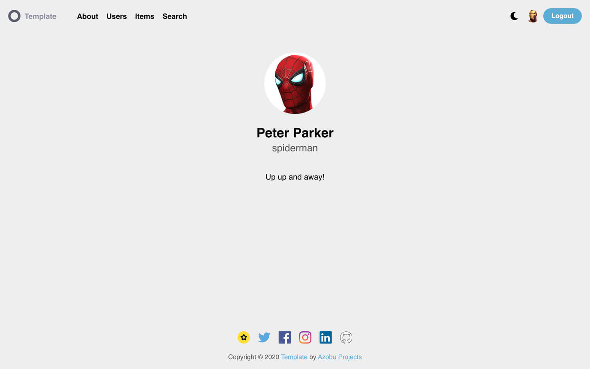   |
| Items          | 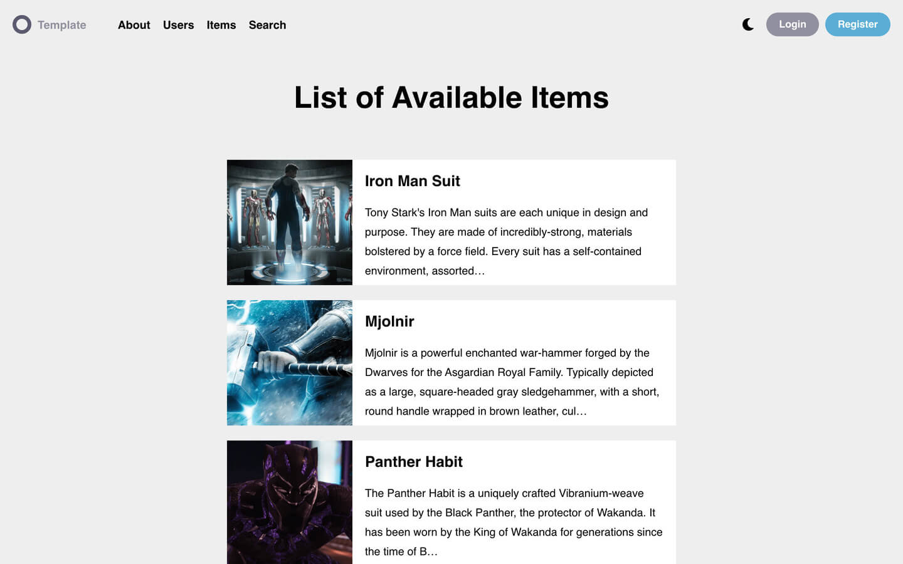          |
| Item           | 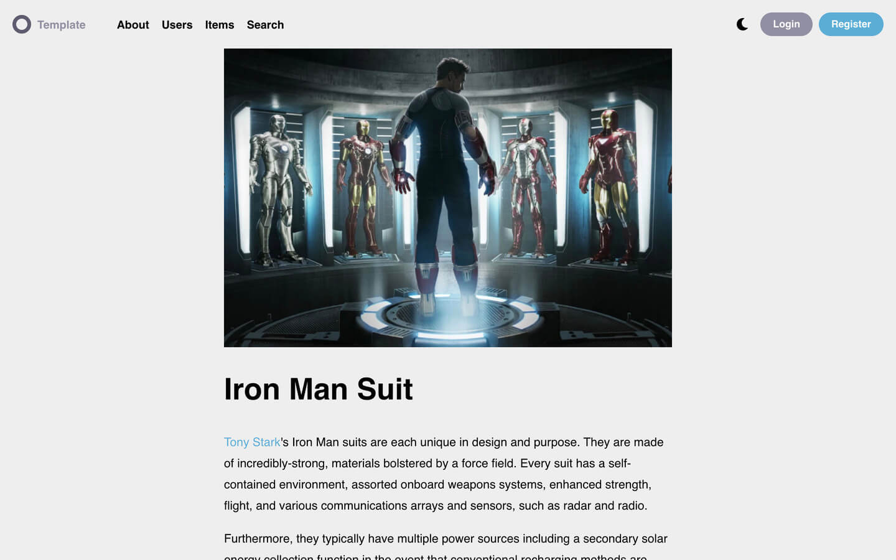           |
| Search Results | 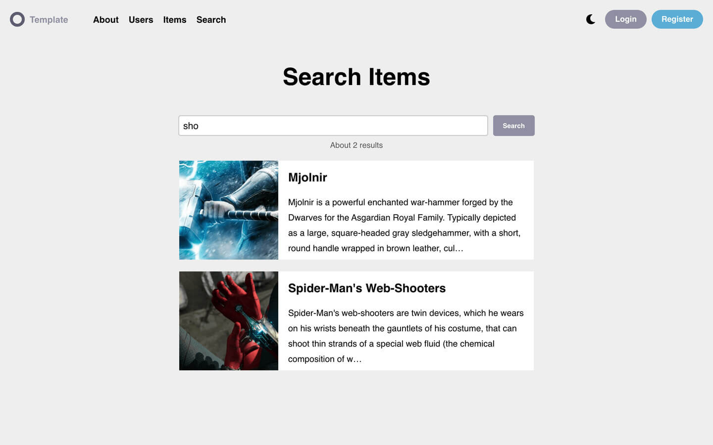 |
| Login          | 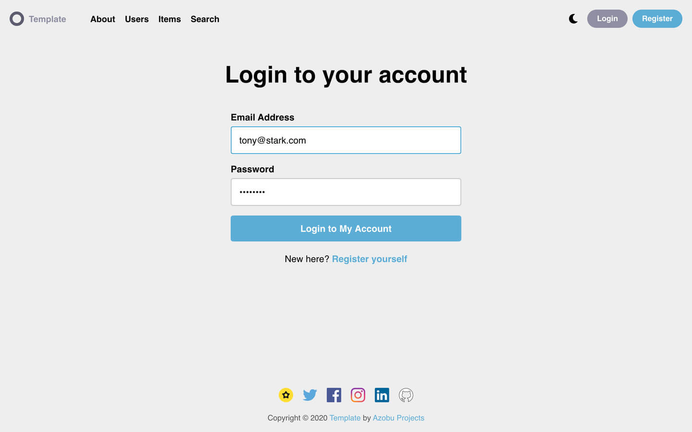          |
| User Settings  | 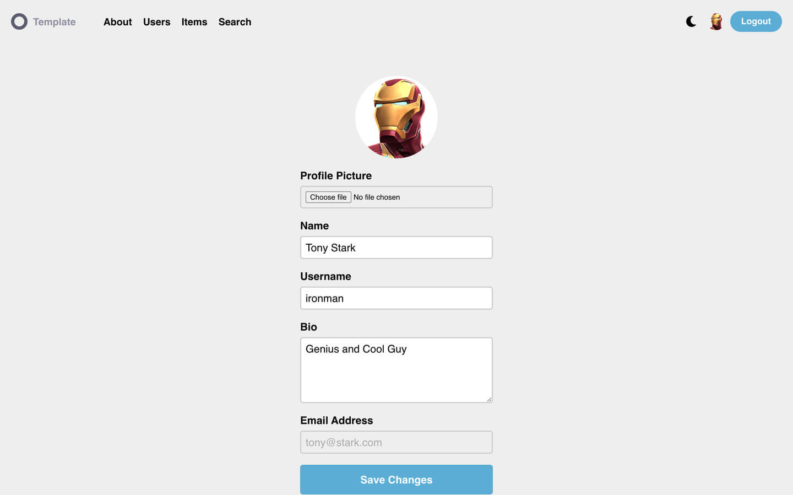  |
| Logout         | 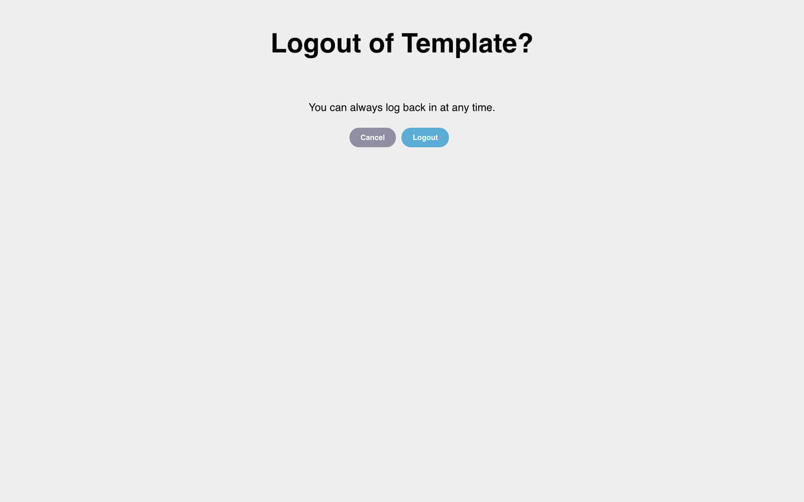         |

## Authors

- [M Haidar Hanif](https://mhaidarhanif.com) ([@mhaidarh](https://github.com/mhaidarh))
- [Azobu Team](https://azobu.com) ([@azobu](https://github.com/azobu))

## License

See [LICENSE](./LICENSE)
